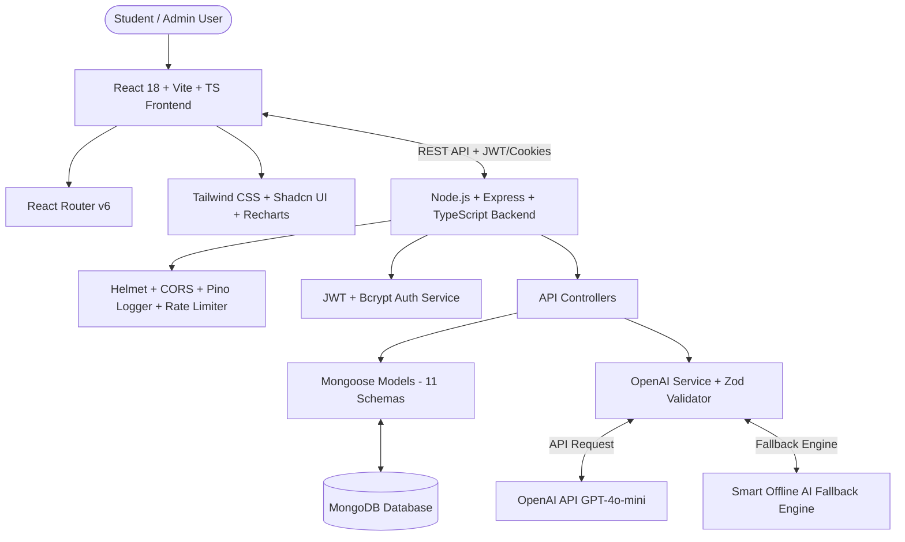
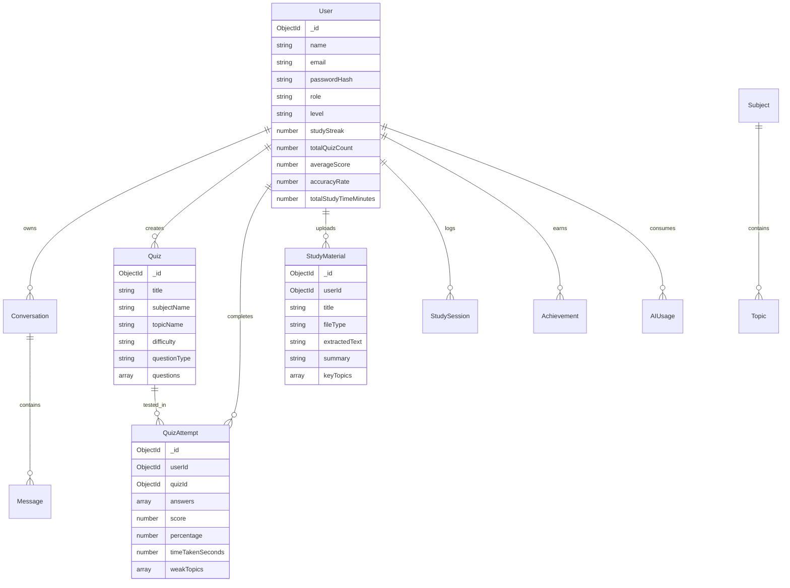
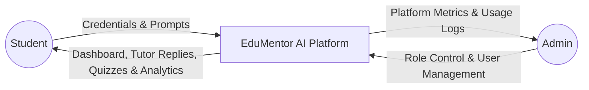

# EduMentor AI — Smart AI Tutor & Adaptive Quiz Generator
> **Final Year College Project | B.Tech / BE Computer Science & Engineering**

EduMentor AI is a production-quality, full-stack educational web application designed to revolutionize student learning through personalized AI tutoring, structured adaptive quiz generation, PDF notes document grounding, and real-time performance analytics.

---

## 📋 Table of Contents
1. [Project Overview](#project-overview)
2. [Problem Statement & Objectives](#problem-statement--objectives)
3. [System Architecture](#system-architecture)
4. [Database Design & ER Diagram](#database-design--er-diagram)
5. [Data Flow Diagrams (DFD)](#data-flow-diagrams-dfd)
6. [Tech Stack](#tech-stack)
7. [Core Features](#core-features)
8. [API Reference](#api-reference)
9. [Installation & Local Setup](#installation--local-setup)
10. [Environment Variables](#environment-variables)
11. [Testing & Verification](#testing--verification)
12. [College Final Year Project Report Outline](#college-final-year-project-report-outline)

---

## 🎯 Project Overview

In traditional educational paradigms, students face one-size-fits-all instruction, lack of instant feedback, and rigid practice materials. **EduMentor AI** bridges this gap by offering:
- A **ChatGPT-style AI Educational Tutor** that acts like a private teacher: explaining concepts simply, providing analogies, step-by-step breakdowns, and Hindi/English support.
- An **AI Assessment Engine** that generates structured quizzes (MCQ, True/False, Fill in Blank, Short Answer) validated with Zod schemas.
- A **Document Grounding Pipeline** allowing students to upload PDF/text study notes, ask questions about chapter content, and auto-generate custom quizzes directly from notes.
- An **Adaptive Learning Engine** tracking strong/weak topics and visualizing accuracy over time using Recharts.

---

## 🏗️ System Architecture



---

## 🗄️ Database Design & ER Diagram



---

## 🔄 Data Flow Diagrams (DFD)

### DFD Level 0 (Context Level)



---

## 💻 Tech Stack

### Frontend
- **Framework**: React 18 + TypeScript + Vite
- **Styling**: Tailwind CSS + Glassmorphism Custom UI + Lucide Icons
- **State & Routing**: React Router v6 + TanStack React Query + Context API
- **Charts**: Recharts (Line, Bar, Area charts)
- **Forms**: React Hook Form + Zod

### Backend
- **Runtime**: Node.js + Express.js + TypeScript
- **Database**: MongoDB + Mongoose ODM (11 Models)
- **Security**: JWT + HTTP-only cookies, Bcrypt, Helmet, CORS, Rate Limiting
- **Logging**: Pino + Pino-pretty
- **File Parsing**: Multer + pdf-parse

### AI Engine
- **OpenAI API**: GPT-4o-mini / GPT-3.5-turbo integration
- **Validation**: Strict Zod output validation
- **Fallback Engine**: Smart Educational Fallback Engine (runs offline without API key)

---

## 📡 API Reference

| Method | Endpoint | Description | Auth Required |
| :--- | :--- | :--- | :--- |
| `POST` | `/api/auth/register` | Register new student or admin account | No |
| `POST` | `/api/auth/login` | Login user & issue JWT cookie | No |
| `GET` | `/api/auth/me` | Get current user profile | Yes |
| `GET` | `/api/tutor/conversations` | Get user AI tutor chat sessions | Yes |
| `POST` | `/api/tutor/conversations/:id/messages` | Send message to AI Tutor (Explain, Analogy, Step-by-Step, Hindi) | Yes |
| `POST` | `/api/quizzes/generate` | Generate structured AI Quiz | Yes |
| `GET` | `/api/quizzes` | Fetch available quizzes | Yes |
| `POST` | `/api/quiz-attempts/submit` | Submit attempt, calculate score & weak topics | Yes |
| `GET` | `/api/progress/dashboard` | Get student metrics & recommendations | Yes |
| `GET` | `/api/progress/analytics` | Recharts progress data | Yes |
| `POST` | `/api/materials/upload` | Upload PDF/Text study notes | Yes |
| `POST` | `/api/materials/:id/chat` | Ask grounded AI questions on document | Yes |
| `POST` | `/api/materials/:id/generate-quiz` | Generate quiz from uploaded notes | Yes |
| `GET` | `/api/admin/metrics` | Platform metrics & token usage | Admin Only |

---

## ⚡ Installation & Local Setup

### Prerequisites
- **Node.js**: v18.0.0 or higher
- **npm**: v9.0.0 or higher
- **MongoDB**: Local MongoDB server or MongoDB Atlas URI (Optional fallback mode included)

### 1. Clone & Setup Backend
```bash
cd edu-mentor-ai/server
npm install
npm run dev
```
Backend runs on `http://localhost:5000`.

### 2. Setup Frontend Client
```bash
cd ../client
npm install
npm run dev
```
Frontend runs on `http://localhost:5173`.

---

## ⚙️ Environment Variables

### Server (`server/.env`)
```env
PORT=5000
NODE_ENV=development
MONGODB_URI=mongodb://localhost:27017/edumentor_db
JWT_SECRET=edumentor_ai_super_secret_jwt_key_2026_final_year_project
JWT_EXPIRES_IN=7d
CLIENT_URL=http://localhost:5173
OPENAI_API_KEY=your_openai_api_key_here
```

---

## 🧪 Testing & Verification

Run backend unit and integration test suite with Vitest:
```bash
cd server
npm test
```

---

## 🎓 College Final Year Project Report Outline

For submitting your college project dissertation, structure your documentation report as follows:

1. **Abstract**: Summary of AI-driven personalized learning and adaptive testing.
2. **Chapter 1: Introduction**: Background, motivation, and scope of EduMentor AI.
3. **Chapter 2: Existing System vs Proposed System**: Comparison with traditional LMS.
4. **Chapter 3: System Requirements Specification (SRS)**: Hardware/Software specs, functional & non-functional requirements.
5. **Chapter 4: System Design & UML Diagrams**: ER Diagram, Use Case Diagram, DFD Level 0/1/2, Sequence Diagram.
6. **Chapter 5: Implementation Details**: Module descriptions, AI prompt engineering, Zod schemas, security implementation.
7. **Chapter 6: Testing & Results**: Test cases, Vitest results, accuracy metrics.
8. **Chapter 7: Conclusion & Future Scope**: Summary of project outcomes, voice-based tutoring, multi-modal PDF vision support.
